## Part 1. Инструмент ipcalc ##

-  Устанавливаем ipcalc
 

### 1.1 Сети и маски ###
- Адрес сети 192.167.38.54/13
 

#### Перевод маски 255.255.255.0 в префиксную и двоичную запись, /15 в обычную и двоичную, 11111111.11111111.11111111.11110000 в обычную и префиксную ####

- 255.255.255.0 в префиксной форме - /24, а в двоичной - 11111111.11111111.11111111.00000000
 

- /15 - 11111111.11111110.00000000.00000000
 

- 11111111.11111111.11111111.11110000 - /28 или 255.255.255.240
 

#### Минимальный и максимыльный хост в сети 12.167.38.4 при масках: /8, 11111111.11111111.00000000.00000000, 255.255.254.0 и /4 ####

- для адреса 12.167.38.4 при маске /8 минимальный хост - 12.0.0.1, максимальный хост 12.255.255.254
 

- при маске 11111111.11111111.00000000.00000000 минимальный хост - 12.167.0.1, максимальный хост 12.167.255.254
 

- 255.255.254.0 минимальный хост - 12.167.38.1, максимальный хост 12.167.39.254
 

- /4 минимальный хост - 0.0.0.1, максимальный хост 15.255.255.254
 

### 1.2 localhost ###

#### Определим и запишем в отчёт, можно ли обратиться к приложению, работающему на localhost, со следующими IP: 194.34.23.100, 127.0.0.2, 127.1.0.1, 128.0.0.1 ####

- 194.34.23.100 - нет
- 127.0.0.2 - да
- 127.1.0.1 - да
- 128.0.0.1 - нет

### 1.3 Диапазоны и сегменты сетей ###

1. Какие из перечисленных IP можно использовать в качестве публичного, а какие только в качестве частных: 10.0.0.45, 134.43.0.2, 192.168.4.2, 172.20.250.4, 172.0.2.1, 192.172.0.1, 172.68.0.2, 172.16.255.255, 10.10.10.10, 192.169.168.1

- 10.0.0.45 - private
- 134.43.0.2 - public
- 192.168.4.2 - private
- 172.20.250.4 - private
- 172.0.2.1 - public
- 192.172.0.1 - piblic
- 172.68.0.2 - public
- 172.16.255.255 - private
- 10.10.10.10 - private
- 192.169.168.1 - public

2. Какие из перечисленных IP-адресов шлюза возможны у сети 10.10.0.0/18: 10.0.0.1, 10.10.0.2, 10.10.10.10, 10.10.100.1, 10.10.1.255

- 10.0.0.1 - нет
- 10.10.0.2 - да
- 10.10.10.10 - да
- 10.10.100.1 - нет
- 10.10.1.255 - да

## Part 2. Статическая маршрутизация между двумя машинами ##

- С помощью команды `ip a` посмотрим существующие сетевые интерфейсы
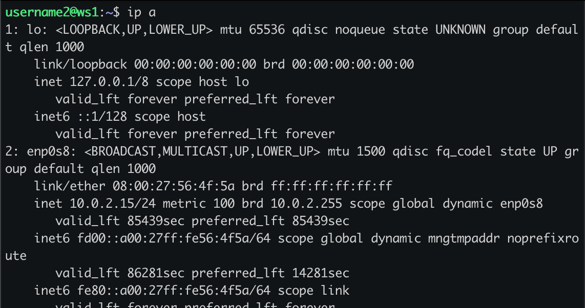 
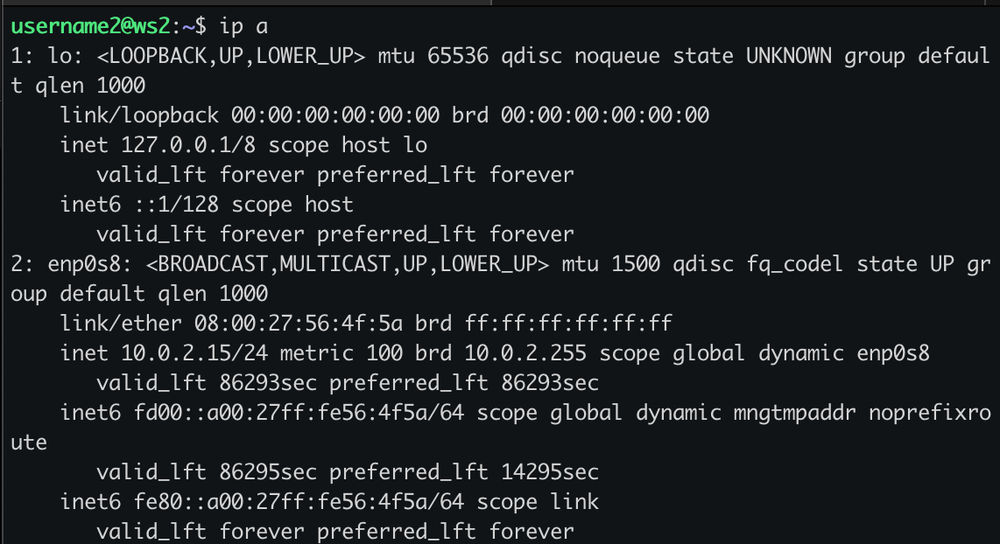 

Описать сетевой интерфейс, соответствующий внутренней сети, на обеих машинах и задать следующие адреса и маски: ws1 - 192.168.100.10, маска /16, ws2 - 172.24.116.8, маска /12

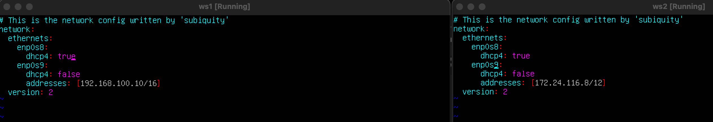 

Выполним команду `netplan apply` для перезапуска сервиса сети
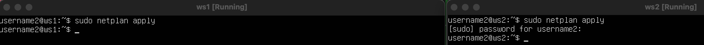 

### 2.1 Добавление статического маршрута вручную ###

#### Добавь статический маршрут от одной машины до другой и обратно при помощи команды вида `ip r add.` ####

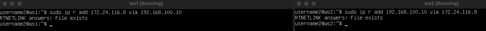 

#### Пропингуй соединение между машинами ####

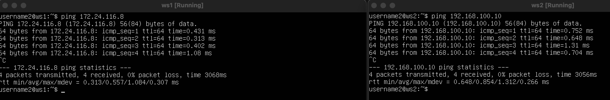 

### 2.2 Добавление статического маршрута с сохранением ###

#### Перезапусти машину ####

#### Добавь статический маршрут от одной машины до другой с помощью файла etc/netplan/00-installer-config.yaml. ####

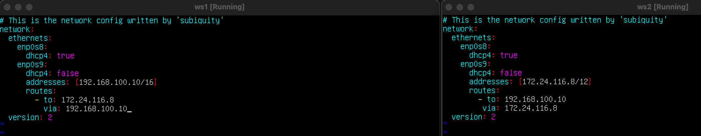 

#### Пропингуй соединение между машинами. ####

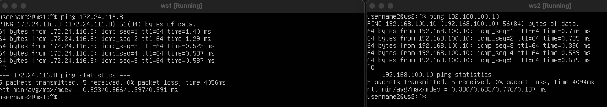 

## Part 3. Утилита iperf3 ##

### 3.1. Скорость соединения ###

#### Переведи и запиши в отчёт: 8 Mbps в MB/s, 100 MB/s в Kbps, 1 Gbps в Mbps. ####
#### 8 Mbps = (Mbps / 8) = 1 MB/s ####
#### 100 MB/s = (MB/s * 8 * 1024) = 819200 Kbps ####
#### 1 Gbps = (Gbps * 1000) = 1000 Mbps #### 

### 3.2. Утилита iperf3 ###

#### Измерь скорость соединения между ws1 и ws2. ####

- На машине ws2 запускаем сервер утилиты ipref3 с помощью команды ipref3 -s, для того чтоб машина принимала входящее соединение.
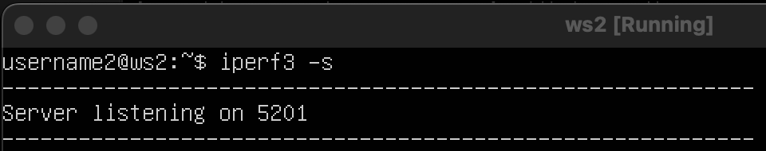 

- На машине ws1 запускаем клиент утилиты ipref3 для отправки данных на машину ws1 с помощью команды ipref3 -c 172.24.116.8
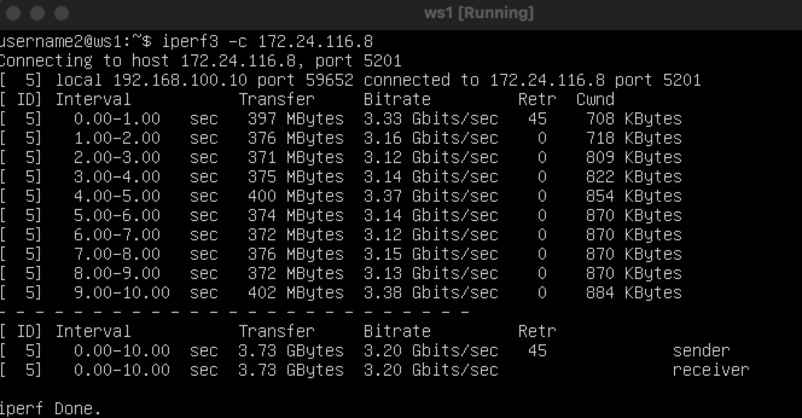 

## Part 4. Сетевой экран ##

### 4.1. Утилита iptables ###

Нужно создать файл `/etc/firewall.sh` и добавить в файл подряд следующие правила:

1) На ws1 примени стратегию, когда в начале пишется запрещающее правило, а в конце пишется разрешающее правило (это касается пунктов 4 и 5).

2) На ws2 примени стратегию, когда в начале пишется разрешающее правило, а в конце пишется запрещающее правило (это касается пунктов 4 и 5).

3) Открой на машинах доступ для порта 22 (ssh) и порта 80 (http).

4) Запрети echo reply (машина не должна «пинговаться», т. е. должна быть блокировка на OUTPUT).

5) Разреши echo reply (машина должна «пинговаться»).

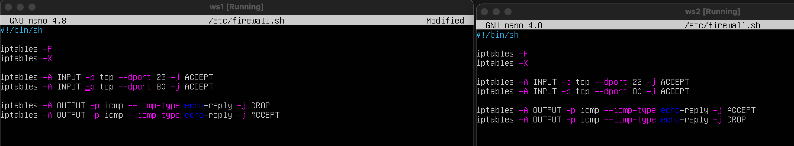

- в отчете поместить скрины с запуском обоих файлов
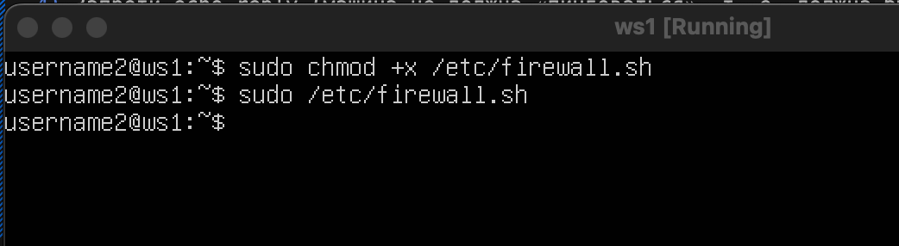
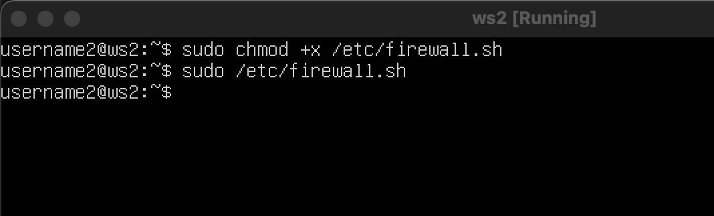

- В отчёте опиши разницу между стратегиями, применёнными в первом и втором файлах.

- - На **ws1** весь трафик изначально блокируется (**DROP**), после чего разрешаются только определённые подключения (**ACCEPT**), и всё, что не соответствует установленным правилам, отклоняется. На **ws2**, наоборот, весь трафик сначала разрешается (**ACCEPT**), а затем блокируются только определённые подключения (**DROP**), в результате чего остаётся доступным всё, что не подпадает под запрет.

### 4.2. Утилита nmap ###

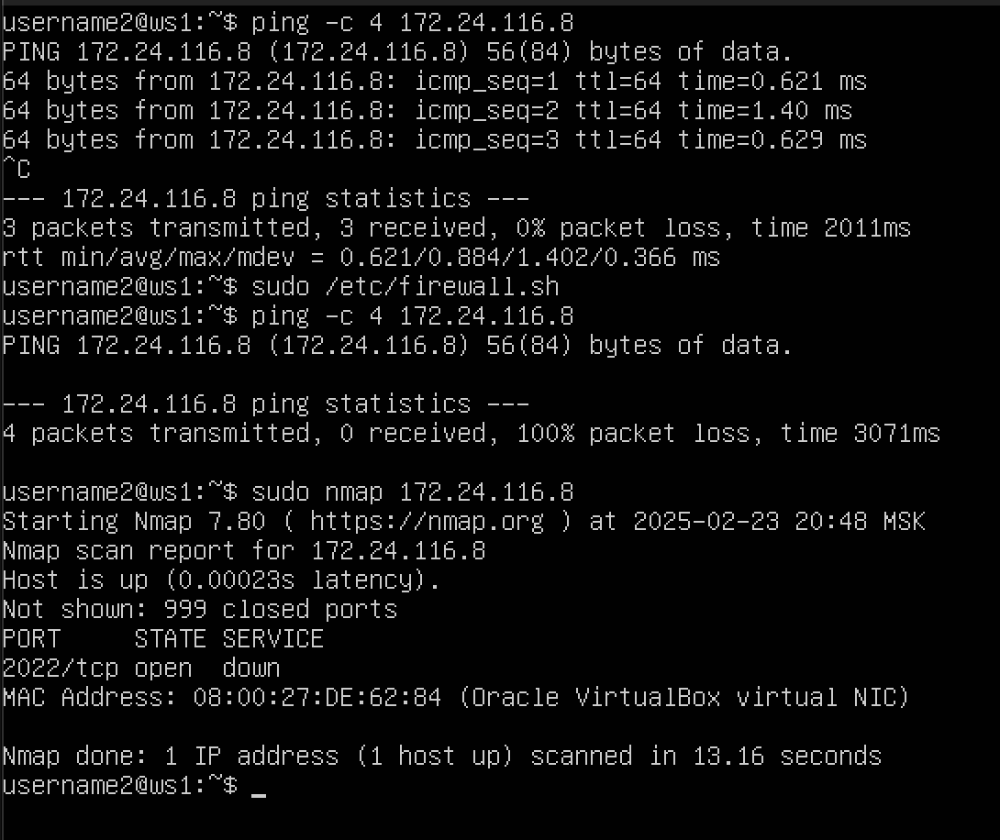
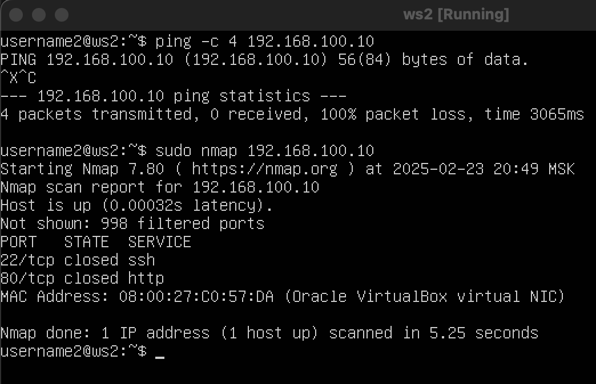

## Part 5. Статическая маршрутизация сети ##

### 5.1 Настройка адресов машин ###

настройка файла netplan согласно рисунку

r1
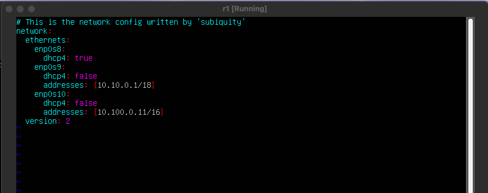

r2
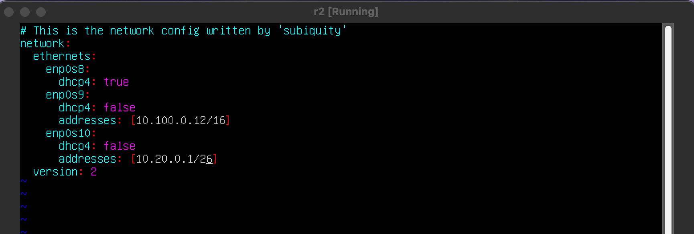

ws11
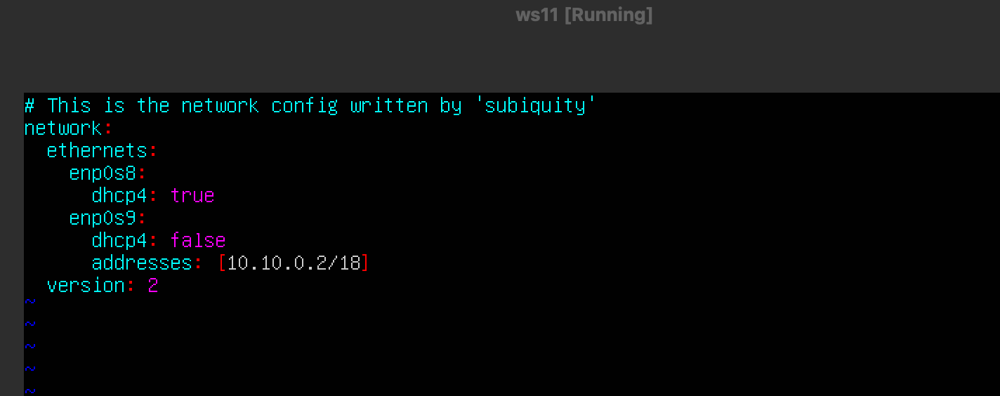

ws21
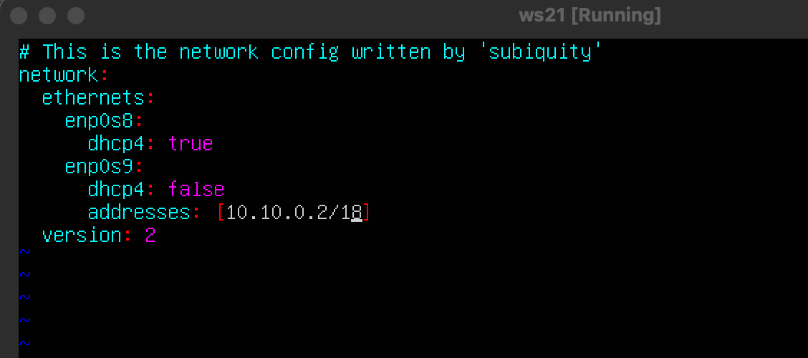

ws22
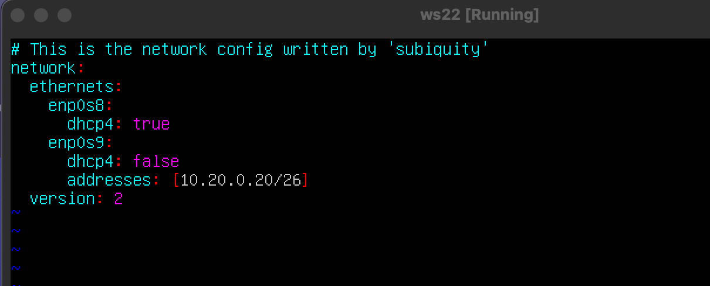