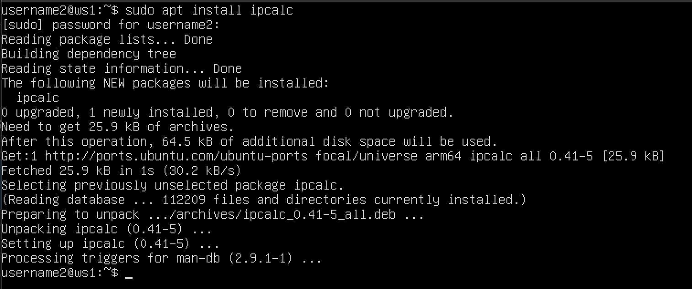
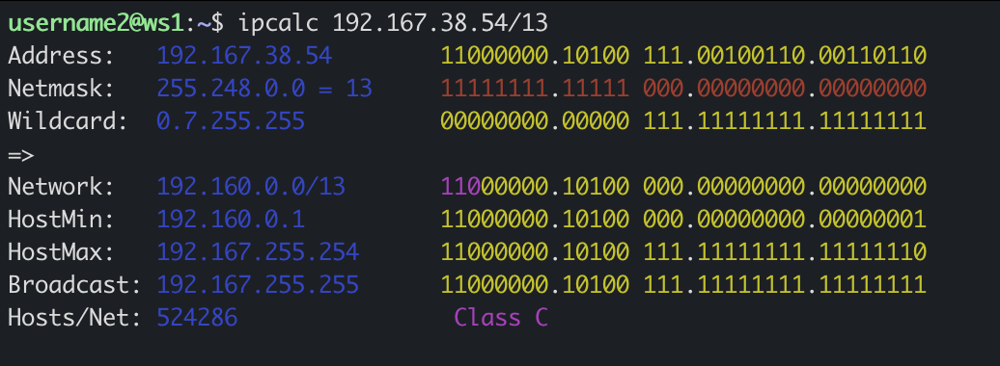
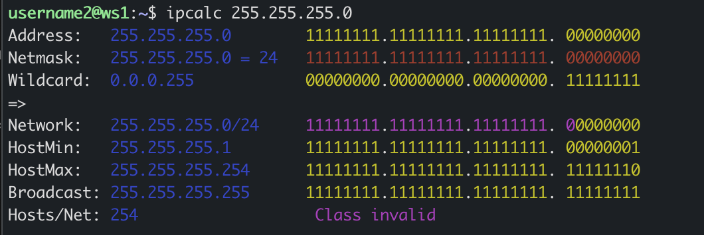
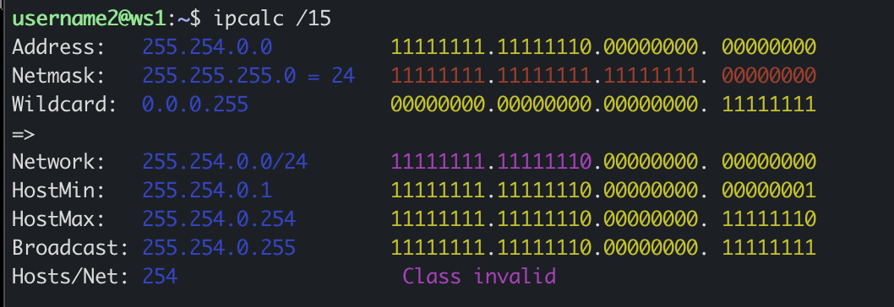
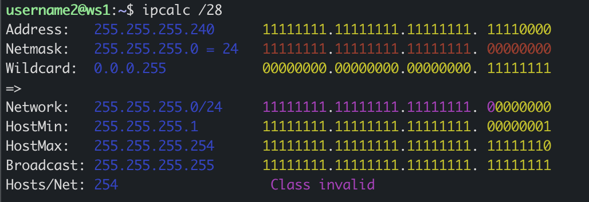
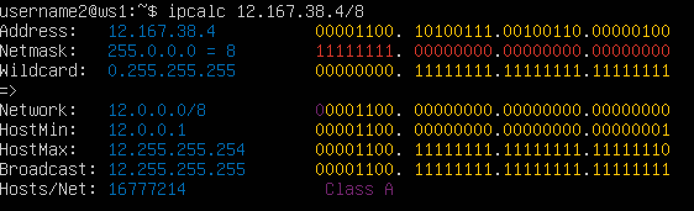
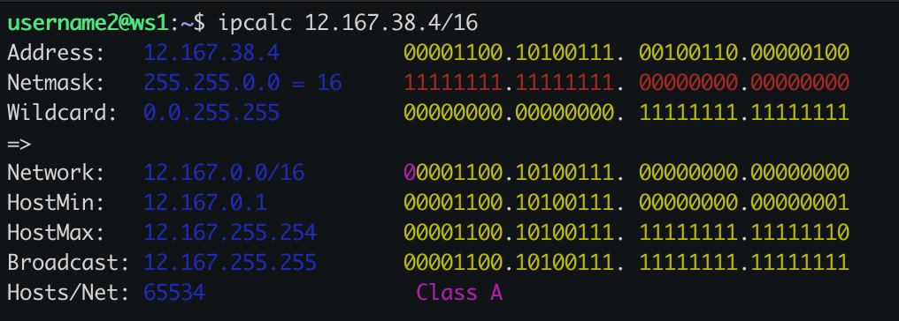
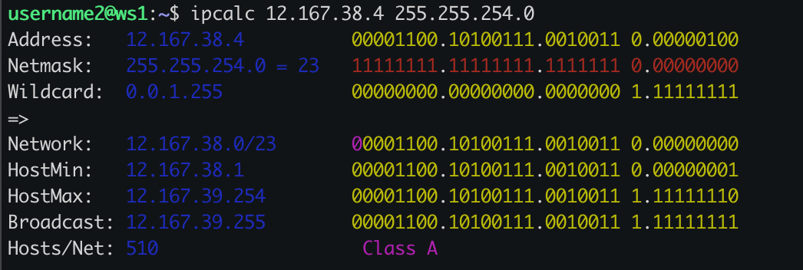
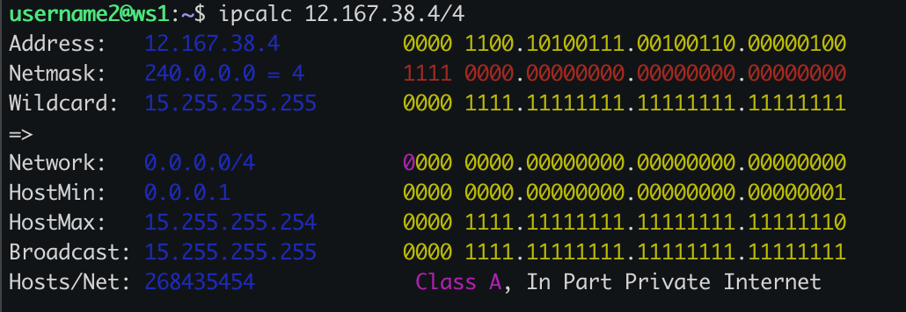

## Part 1. Инструмент ipcalc

-  Устанавливаем ipcalc
 

### 1.1 Сети и маски ###
- Адрес сети 192.167.38.54/13
 

#### Перевод маски 255.255.255.0 в префиксную и двоичную запись, /15 в обычную и двоичную, 11111111.11111111.11111111.11110000 в обычную и префиксную ####

- 255.255.255.0 в префиксной форме - /24, а в двоичной - 11111111.11111111.11111111.00000000
 

- /15 - 11111111.11111110.00000000.00000000
 

- 11111111.11111111.11111111.11110000 - /28 или 255.255.255.240
 

#### Минимальный и максимыльный хост в сети 12.167.38.4 при масках: /8, 11111111.11111111.00000000.00000000, 255.255.254.0 и /4 ####

- для адреса 12.167.38.4 при маске /8 минимальный хост - 12.0.0.1, максимальный хост 12.255.255.254
 

- при маске 11111111.11111111.00000000.00000000 минимальный хост - 12.167.0.1, максимальный хост 12.167.255.254
 

- 255.255.254.0 минимальный хост - 12.167.38.1, максимальный хост 12.167.39.254
 

- /4 минимальный хост - 0.0.0.1, максимальный хост 15.255.255.254
 

### 1.2 localhost ###

#### Определим и запишем в отчёт, можно ли обратиться к приложению, работающему на localhost, со следующими IP: 194.34.23.100, 127.0.0.2, 127.1.0.1, 128.0.0.1 ####

- 194.34.23.100 - нет
- 127.0.0.2 - да
- 127.1.0.1 - да
- 128.0.0.1 - нет

### 1.3 Диапазоны и сегменты сетей ###

1. Какие из перечисленных IP можно использовать в качестве публичного, а какие только в качестве частных: 10.0.0.45, 134.43.0.2, 192.168.4.2, 172.20.250.4, 172.0.2.1, 192.172.0.1, 172.68.0.2, 172.16.255.255, 10.10.10.10, 192.169.168.1

- 10.0.0.45 - private
- 134.43.0.2 - public
- 192.168.4.2 - private
- 172.20.250.4 - private
- 172.0.2.1 - public
- 192.172.0.1 - piblic
- 172.68.0.2 - public
- 172.16.255.255 - private
- 10.10.10.10 - private
- 192.169.168.1 - public

2. Какие из перечисленных IP-адресов шлюза возможны у сети 10.10.0.0/18: 10.0.0.1, 10.10.0.2, 10.10.10.10, 10.10.100.1, 10.10.1.255

- 10.0.0.1 - нет
- 10.10.0.2 - да
- 10.10.10.10 - да
- 10.10.100.1 - нет
- 10.10.1.255 - да

## Part 2. Статическая маршрутизация между двумя машинами